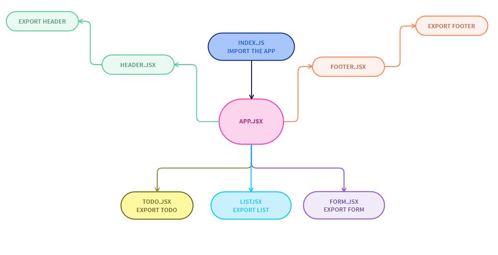
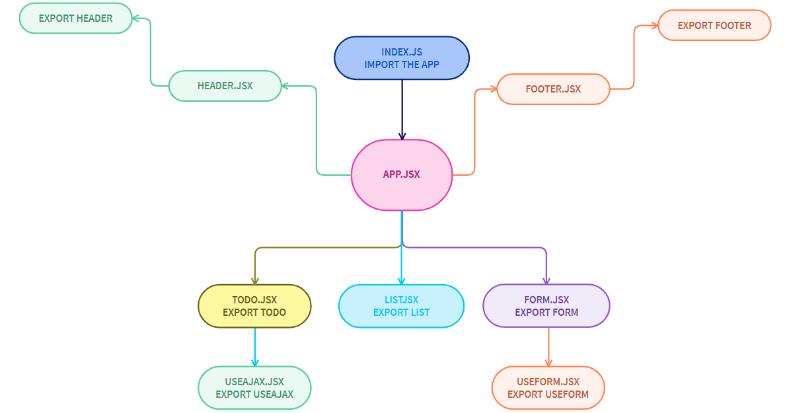

# **TODO APP**

## **Hooks API**

### **LAB - 31**

**To Do List Manager Phase 1:** Begin the build of an application designed for creating and organizing a “To Do” list in your browser.

In this initial phase, we’re going to have to start by converting a legacy application into a more modern architecture. Our initial “Proof of Concept” was written using class based components and was not properly styled. Now that our client has given us the “green light” for development, we’re going to refactor the application using Hooks and upgrading the style.

#### **Phase 1 Requirements**

Today, we begin the first of a 4-phase build of the To Do List Manager, a web-based task manager application, written in React. In this first phase, our goal is to setup a foundational system using React hooks that we can build upon in later phases, adding databases, logins, and more advanced features.

The following user/developer stories detail the major functionality for this phase of the project :

* As a user, I would like an easy way to add a new to do item using an online interface
* As a user, I would like my to do items to have an assignee, due date, difficulty meter, status and the task itself
* As a user, I would like to delete to do items that are no longer needed
* As a user, I would like to easily mark to do items as completed
* As a user, I would like to edit an existing to do item

### **Author: Farah AlWahaibi**

* [PR LINK1](https://github.com/farahalwahaibi/todo/pull/1)

### **Installation**
* **dependencies :**
  *  "@testing-library/jest-dom"
  *  "@testing-library/react"
  *  "@testing-library/user-event"
  *  "react"
  *  "react-dom"
  *  "react-router-dom"
  *  "react-scripts"
  *  "sass"
  *  "web-vitals"
  *  "yarn"
  *  "uuid"
  *  "react-jsonschema-form"
  *  "bootstrap"
  *  "react-bootstrap"

### **Running the app**
* **npm start**

## **UML DIAGRAM PHASE-1**

***
***

#### **Phase 2 Requirements**

In Phase 2, we’re going to connect the To Do Manager to a deployed API, backed by a database. The core functionality and stories do not change (reference Phase 1), but a new one has been added to note this shift in persistence.

* As a user, I would like to be able to add, update, and delete To Do items
* As a user, I would like my To Do Items to be permanently stored so that I can re-access them at any time, using any device

#### **Technical Requirements / Notes**

Technical requirements for the core application are unchanged from Phase 1, with the following exceptions and notes:

* On application start, display all of the to do items from the API/Database
* When adding an item, issue a POST request to the API server
* When marking items complete, issue a PUT request to the API server for the item
* When deleting items, issue a DELETE request to the API server for the item

**Implementation Requirements**

* Design Requirement:
  * Follow the included mockup
  * Implement using React Bootstrap Components, not your own bespoke markup/css

* API:
  * You have previously built a working, and deployed API server that handles data models such as categories and products
  * Add a new data model for “To Do” items as noted in the Business Requirements document, and deploy it to Heroku

* Hooks:
  * Use the useEffect() hook to pre-load the To Do Items from the API on application start
  * Replace the current form change/submit handlers with the useForm() custom hook to manage the “Add Item” form
  * Create a new custom hook called useAjax() to abstract the API calls 
    * Using this hook in your component should make the calls to the server
    * This hook should :
      * Accept the URL to the API server, the REST method, and (when relevant) the BODY (JSON) of the request
      * Handle CORS Settings, Content-Type, Headers and possibly authentication
      * You should use axios to perform the actual AJAX calls

* [PR LINK1](https://github.com/farahalwahaibi/todo/pull/2)

### **Installation**
* **dependencies :**
  *  "@testing-library/jest-dom"

## **UML DIAGRAM PHASE-2**

